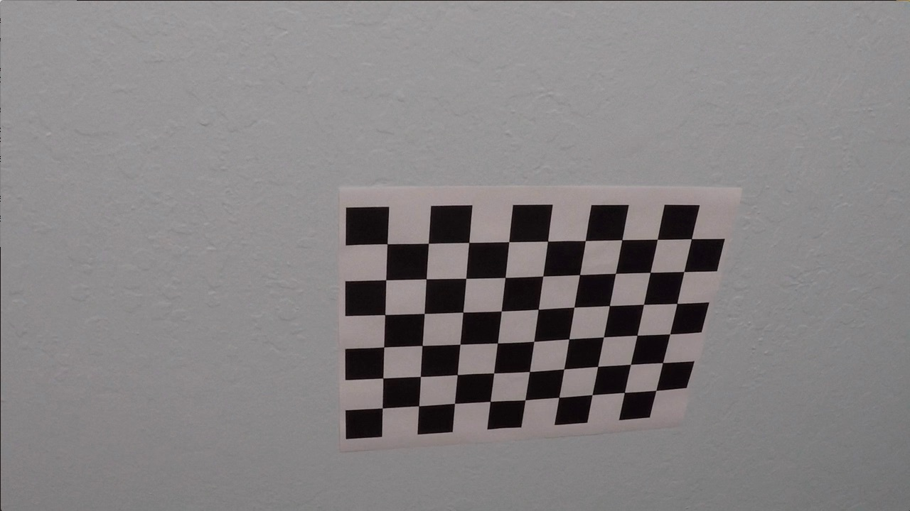
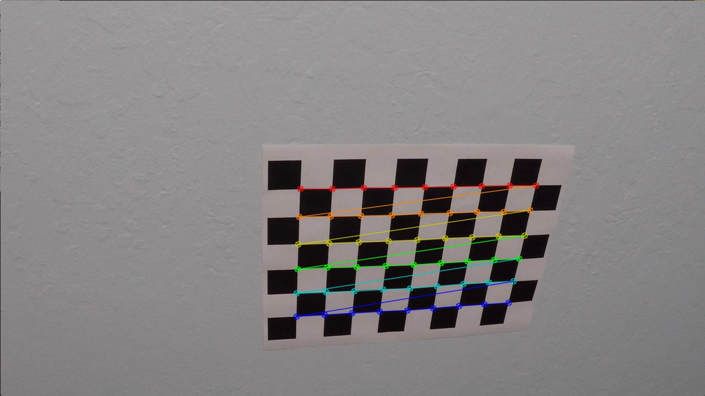
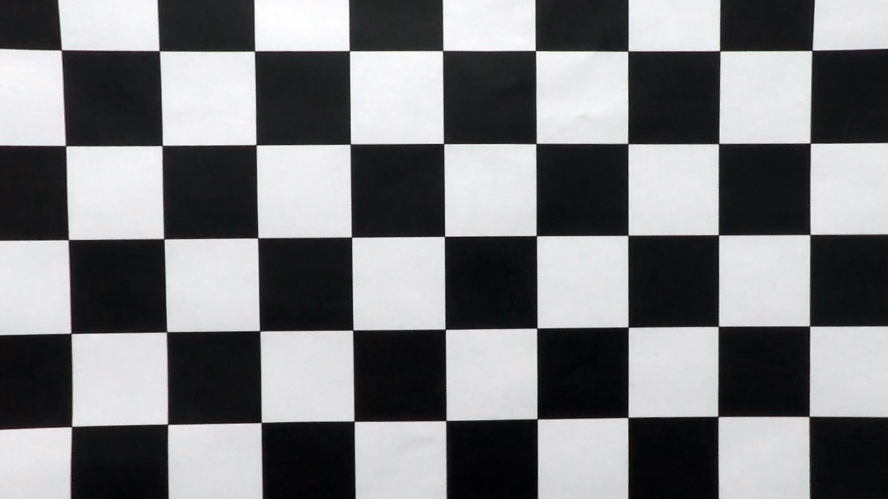

# ReadMe
---

## **Advanced Lane Finding Project**

#### The purpose of this project is to create an Image Processesing script which is capable of detecting lane lines and projecting those lines onto an image.

##### The steps were as follows :
1. Calibrate our Camera and create a correction matrix to adjust for distortions.
2. Read images from a video file and perform binary masking to isolate important information
3. Perform a perspective transform on our binary masks to gain a top-down view of our images.
4. Use Detection techniques to identify lane lines and calculate pertinent information (Curvature, distance from center of lane).
5. Draw lane lines onto output image and save as a video file.
6. Discussion on project

### 1. Camera Calibration

* Camera Calibration was down using the OpenCV Library. Approximately 20 pictures of a known chessboard pattern were taken with our camera. The corners of the images were identified, and mapped against our known pattern to generate distortion coefficients. (Using cv2. findChessboardCorners, and cv2.calibrateCamera on line 15 of Pre-Processing code). This distortion correction technique was then applied to all images in our data pipeline.

### 2. Binary Masking

* After correcting images for distortion, a binary mask was generating by extracting the RGB and converted HLS channels of our image. A series of threshold values were implemented and anded together in order to elminate supurflous information while preserving line lane details from our images (as seen in the function compute_binary() on line 55 of Binary Masking Fucntions). A combiniation of the R/S/L/B channels are implemented. Gradient Images processessing techniques were also explored, however the RLSB method proved to provide a more robust solution for the majority of the images. The first image is our distorted image, followed by our corrected image. The next four show the RSLB color channels, with the following image exploring gradient methods next to our RSLB method. The final image being a larger image of the RSLB technique chosen. 

### 3. Perspective Transform

* After a Binary Mask was applied, a perspective transform was performed in order to gain a 2 dimensional top-down view of our lane. This process was performed in in the warp() function on line 3 of the Image Warping Functions block. A polygon set of source coordinates were chosen such that they pertain to a rectangular set of destination coordinates once our transform was performed. The following image is an example of a before and after transformation : 

### 4. Identify Lane Lines

* A histogram of the bottom-half columns in the binary image was created in order to determine where the maximum number of 'hot' pixels occured. The region to the left of the image center and the region to the right of the image center with the maximum number of pixels correspond to the starting point of our left and right lane lines respectively. This can be seen in the Find Lane Lines Window Function on Block 6 of code.

* After finding a starting point, the image was subdivided into windows of a 200 pixel width and 90 pixel height. The window was centered on the initial starting point, and was incrementally moved upwards towards the top of the image. If a certain number of threshold (50) pixels was found within the window, a new horizantal center point was calculated, and used for the next window's starting point. 

* Once our first image were been mapped, the center points of each window were used as data points for a best-fit 2nd degree polynomial. The polynomial was used to calculate an x value for every y pixel (720px) in our image. This data was then used to perform curvature calculations in the 8th block of code, and compute the distance from the vehicle to the center of our lane on line 40 in the 9th block of code in the draw_lines() function. This data is then displayed in our video.

* After processing our first image, our polynomial data is then used inform the starting position of our lane lines in the next image. A 100 pixel margin around our previouse polynomial line is mapped to our new image, and new line of best fit is calculated from all pixels within that margin (as seen in block 7 of code in the find_lanes() function. Error detection is implemented in block 9 of code in the draw_lines function, by means of testing that the new value of our polynomial does not change too rapidly. If the value of our new polynomial is off by +50%/-33% of a running average for more than 3 frames, the window method is used to calculate a new starting point.

### 5. Draw Lanes on Video Out

* Next, our computed lane lines are drawn on our a blank image, before being transformed back to normal perspective and layered/combined with our orriginal image. This can be seen in block 9 of code with the resultant image on line 57. Finally, our curvature and distance from the center of the lane is mapped on to our image, before exiting the Lane Finding pipeline. The pipelin is condensed to a series of functions on block 10 of code, which is then applied in block 11 in order to create our output video.

### 6. Discussion

* Room for improvement with the project is a more robust resistance to shadowing and color changes in for our binary lane mask. Although the lane lines never completely disapear, or exit far outside the lane, they do shrink considerably during rapid lighting/color changes in the video. 

* An additional area of consideration would be logic for handling skidmarks, turning situations, or areas where there are no solid lane lines such as construction zones, or in intersections. Furthermore, harsh weather conditions such as snow, heavy rain, or lightning would cause considerable disruption to lane detection as the software stands in it's current form.

* One more area for concern would be foreign hazards in the road, as there is no avoidance or object detection algorithms.

The result of the project can be viewed in this [Video](./output_images/video_out.mp4 'Video'). Note, VLC was used in order to play the video. The Video was written with MJPG Fourcc codec, in AVI format, and then transformed to an mp4 with Handbrake in order to conserve space. All code for this project can be found [here](./Production_Main.ipynb 'Code')